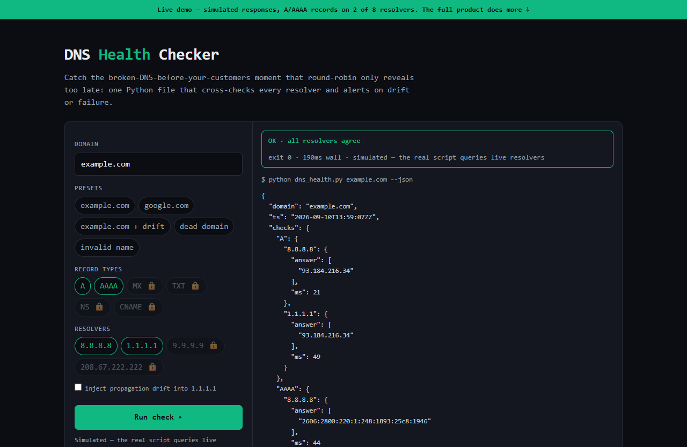

# DNS Health Checker — live demo

  

  <a href="https://amos-mig.github.io/dns-health-checker-api-demo/"><strong>▶ Open the live demo</strong></a> ·
  <a href="https://amosmign.gumroad.com/l/dns-health-checker-api"><strong>Get the full product · €29</strong></a>

## What this is

A client-side simulation of the DNS Health Checker: enter a domain, run a check, and see per-resolver answers, propagation-drift detection, and script exit codes rendered as realistic JSON. The teaser is limited to A/AAAA records on two resolvers; the full kit checks all 6 record types across 8 resolvers with timestamped history.

**Try it:** Type a domain (or click the 'example.com + drift' preset) and hit Run check to watch a stale resolver get flagged with exit code 2, or try a dead domain and an invalid name to see the failure and validation paths.

## What you get in the full product

- Validates A, AAAA, MX, TXT, NS, and CNAME records
- Cross-checks multiple public resolvers for propagation drift
- Timestamped history for spotting slow DNS changes
- Clean exit codes — plug into cron or any monitor
- Single Python file, no dependencies beyond the standard library

## About

- **Storefront:** [kits.amosmignery.dev](https://kits.amosmignery.dev) — single-file products, instant download, commercial license
- **Checkout:** [Gumroad](https://amosmign.gumroad.com/l/dns-health-checker-api) (Merchant of Record, VAT handled)
- **Full product:** [DNS Health Checker](https://amosmign.gumroad.com/l/dns-health-checker-api) · €29

## License

The demo page in this repo is MIT-licensed — reuse the technique, not the product.
The **DNS Health Checker** itself is not included here and is not free software.
